# Website Uptime Monitoring App

I built this project to connect a working Python application with Docker, automated testing, GitLab CI/CD, and AWS infrastructure managed through Terraform.

The application checks website availability, records response times, and stores recent results in MySQL. A Flask dashboard displays the latest status and check history. A separate test website provides predictable healthy, failing, and slow responses.

The project started locally in Ubuntu through WSL2. After testing the application, I configured GitLab to build and publish its Docker images, then deploy them to an AWS EC2 instance.

**Current status:** All 11 automated tests passed, both application images were published, and the AWS deployment was verified through the browser. The AWS resources were later deleted using Terraform to avoid ongoing infrastructure costs. There is no active public demo.

This repository contains the public source code and documentation. The GitLab repository used for CI/CD remains private.

## What the Application Does

The dashboard supports adding HTTP and HTTPS websites, checking their availability, viewing recent results, and removing websites from monitoring.

Each monitored website has:

- Its name and URL.
- The latest check result.
- An HTTP status code where available.
- A response time where available.
- The timestamp of its most recent check.
- A history view containing previous results.

### Monitoring Settings

| Setting | Value |
| --- | --- |
| Website check interval | 60 seconds |
| Dashboard refresh interval | 15 seconds |
| Request timeout | 5 seconds |
| History retention | 24 hours |
| Displayed timestamps | CET |
| Dashboard port | 8000 |

The dashboard refresh interval is separate from the website check interval. Refreshing the page displays the latest stored results; it does not mean every website is checked again immediately.

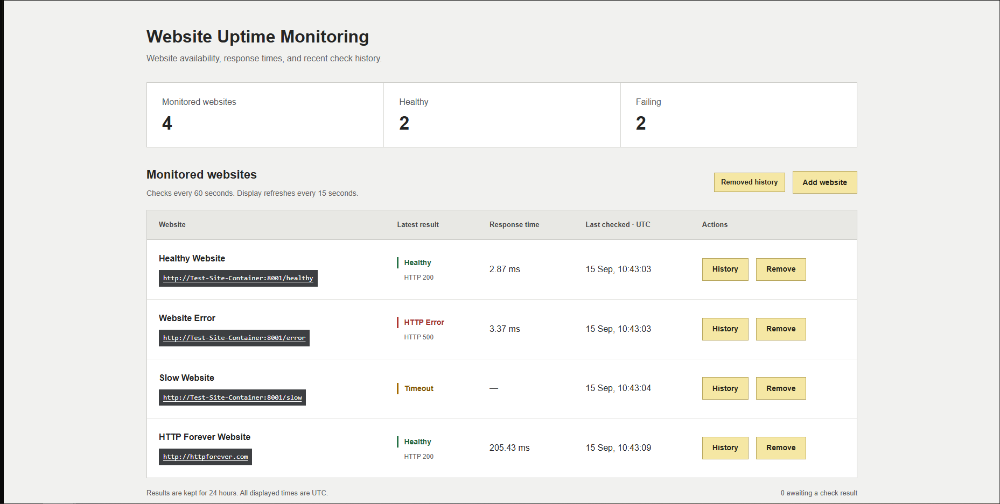

## Technologies Used

| Technology | Purpose |
| --- | --- |
| Python | Website checks, result handling, and application logic |
| Flask | Application routes and dashboard rendering |
| Requests | HTTP requests to monitored websites |
| MySQL 8.4 | Storage for monitored websites and check history |
| MySQL Connector/Python | Database connections from Python |
| Docker | Packaging and running the applications in containers |
| Docker Compose | Service configuration, networking, storage, and startup dependencies |
| pytest | Automated application tests |
| GitLab CI/CD | Testing, building images, and deploying to AWS |
| GitLab Container Registry | Storage for versioned application images |
| Terraform | AWS infrastructure configuration and lifecycle management |
| AWS EC2 | Ubuntu host for the deployed containers |
| AWS IAM and STS | Deployment permissions and temporary AWS credentials |
| AWS Systems Manager | Remote deployment commands and troubleshooting access |
| Ubuntu through WSL2 | Local development environment on Windows |

## How the Application Works

### Three-Container Setup

The application runs as three services:

| Container | Responsibility |
| --- | --- |
| `Monitoring-Container` | Runs the Flask dashboard, checks websites, and saves results |
| `MySQL-Container` | Stores website records and monitoring history |
| `Test-Site-Container` | Provides controlled endpoints for testing |

Docker Compose connects the services through a shared network. The monitoring application reaches MySQL and the test website using their container hostnames.

For example, the healthy test endpoint is available to the monitoring container at:

```text
http://Test-Site-Container:8001/healthy
```

Using `localhost` for this connection would point back to the monitoring container itself, not the separate test website.

The browser accesses the dashboard through port 8000. In the AWS configuration, this port is published on the EC2 host. MySQL and the test website remain internal services without publicly published host ports.

### Website Checks and Storage

The monitoring application sends requests to the configured website URLs and records the results in MySQL.

A successful response is shown as Healthy. A server-error response is shown as HTTP Error. A request that exceeds the configured timeout is shown as Timeout.

Database storage lets the dashboard display both the latest result and earlier checks. A Docker volume holds the MySQL data separately from the database container.

The local and AWS environments use separate databases. Deploying the application does not transfer local website records or monitoring history to AWS.

### Controlled Test Website

I created a separate test website so different outcomes could be tested without depending on a real external outage.

| Endpoint | Behaviour | Expected result |
| --- | --- | --- |
| `/healthy` | Returns HTTP 200 | Healthy |
| `/error` | Returns HTTP 500 | HTTP Error |
| `/slow` | Delays its response for 10 seconds | Timeout |

The slow endpoint exceeds the monitoring application's five-second request timeout.

These endpoints demonstrate three different results in the same dashboard. External HTTP websites were also added and successfully checked.

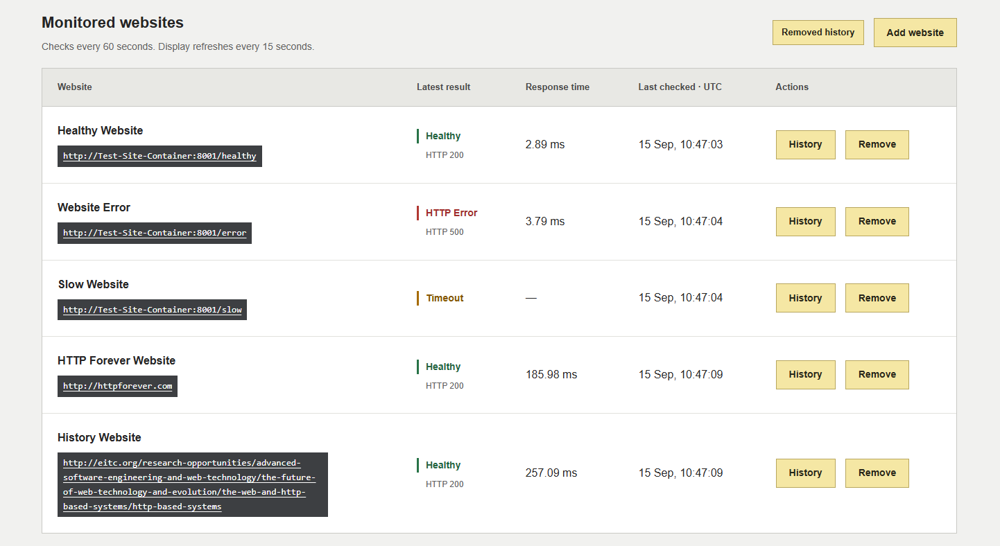

### Monitoring History

The history window displays timestamped checks, results, HTTP codes, response times, and available details.

This makes it possible to inspect repeated failures or changes in response time instead of relying only on the latest status.

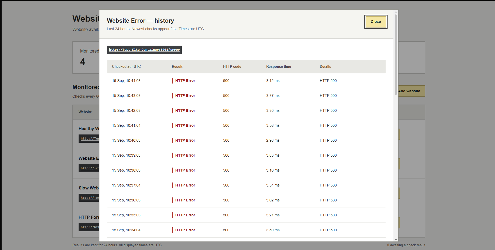

## Local Development

The first working environment ran in Ubuntu through WSL2, using Docker Compose.

Keeping the monitoring application and test website in separate images meant each application had its own Dockerfile and dependency file. MySQL used the official database image.

Local testing covered database connectivity, container startup, dashboard access, controlled website responses, and user-added websites.

<details>
<summary>Local development screenshots</summary>

### Docker Compose Services

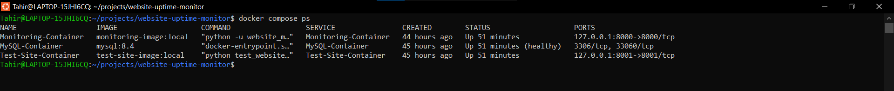

### Development Workspace

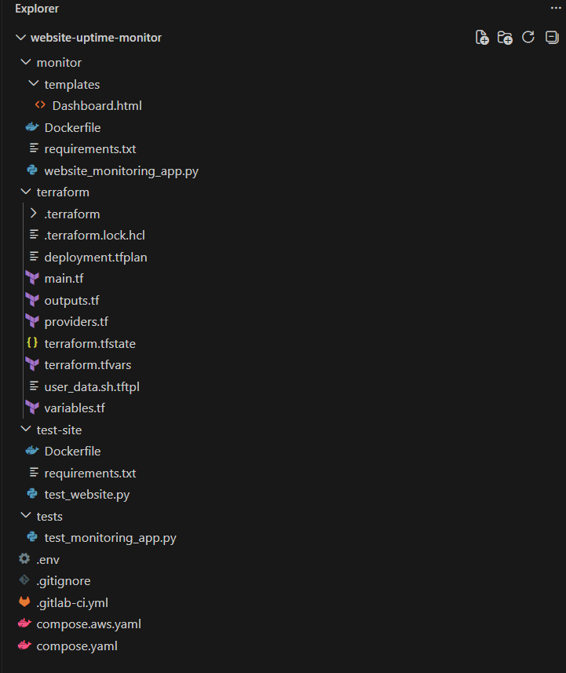

The workspace screenshot includes filenames for local configuration and state. Their private contents are not included in this public repository.

</details>

## GitLab CI/CD

The pipeline has three stages: `test`, `build`, and `deploy`.

| Job | Stage | Responsibility |
| --- | --- | --- |
| `test_monitoring_app` | Test | Wait for MySQL and run the automated tests |
| `build_monitoring_image` | Build | Build and publish the monitoring application image |
| `built_test_website_image` | Build | Build and publish the test website image |
| `deploy_to_aws` | Deploy | Deploy the images to EC2 and verify the dashboard |

The build stage starts after the test stage succeeds. Both image-build jobs can run in parallel.

AWS deployment depends on both builds. I kept it as a manual job on the default branch so publishing a code change would not automatically deploy it.

A resource group prevents overlapping deployment jobs from updating the same environment at the same time.

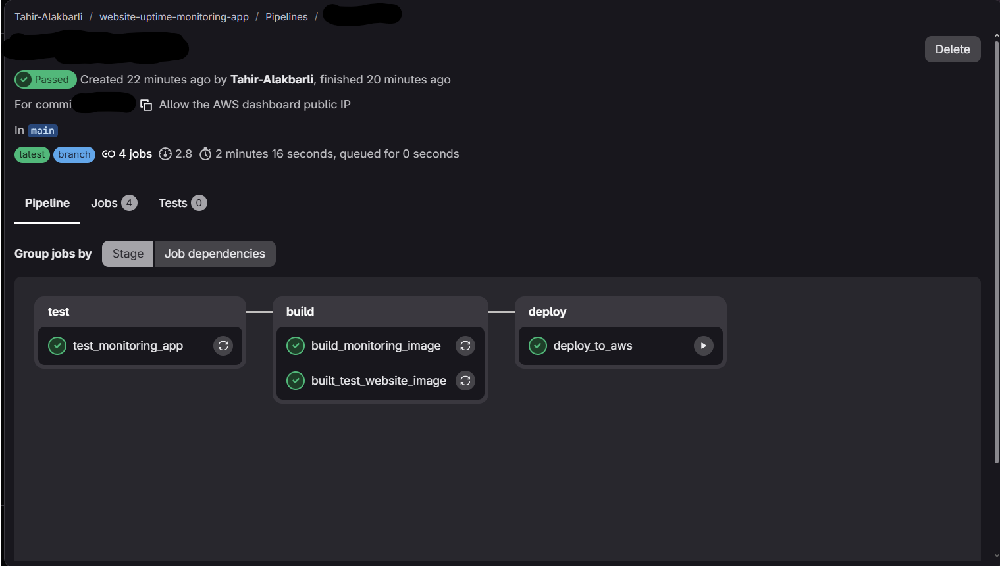

### Test Environment

The test job uses a Python image and starts a MySQL service.

Database credentials come from GitLab CI/CD variables. Before running pytest, the job attempts a database connection and retries while MySQL starts.

This readiness step prevents the test from failing simply because the database service has not finished starting.

### Image Builds and Registry

Each build job uses Docker-in-Docker to build its application image and publish it to GitLab Container Registry.

The image repositories are:

```text
$CI_REGISTRY_IMAGE/monitoring_app
$CI_REGISTRY_IMAGE/test_website
```

GitLab stores the two Docker images in its Container Registry: one for the monitoring app and one for the test website.

Each image gets a tag based on the Git commit it was built from, such as `41687932`. This lets me identify which version of the code is running on AWS.

Successful builds from `main` also update a tag called `latest`. The commit tag identifies a specific build, while `latest` points to the newest published build from `main`.

<details>
<summary>Image build and registry evidence</summary>

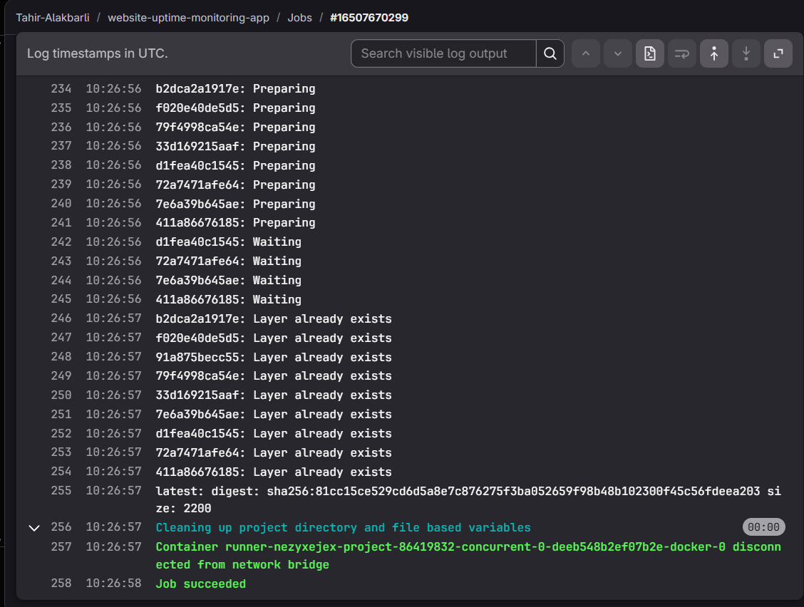

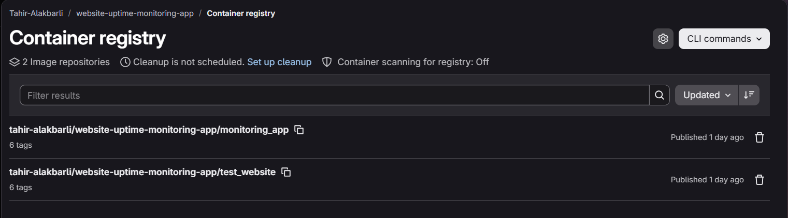

</details>

## AWS Authentication and Deployment

### Temporary Credentials Through OIDC

The deployment job uses OpenID Connect, or OIDC, to authenticate to AWS.

The process is:

1. GitLab issues an ID token to the deployment job.
2. AWS validates the token against the configured identity provider and role trust policy.
3. AWS STS returns temporary credentials.
4. The job uses those credentials for its allowed deployment operations.

The GitLab token is intended for AWS STS, which provides temporary AWS credentials. AWS checks this before allowing the deployment job to sign in.

This avoids storing long-lived AWS access keys in the GitLab deployment configuration. The local AWS profile used for Terraform is separate from this pipeline identity.

The setup follows the approach described in the [GitLab AWS OIDC documentation](https://docs.gitlab.com/ci/cloud_services/aws/).

### Deployment Through Systems Manager

AWS Systems Manager Run Command executes the deployment on the EC2 host.

The GitLab job first finds the running instance and waits for Systems Manager to report it as available. The remote command then waits for the instance setup to finish.

On the server, deployment:

- Authenticates to GitLab Container Registry.
- Updates the selected image tag to the current commit.
- Pulls the required images.
- Starts the Docker Compose stack.
- Checks the dashboard with an HTTP request.
- Reports the command result.

The job monitors the remote command and fails if it reports a deployment error or does not finish within the configured waiting period.

For interactive troubleshooting, I used Session Manager to inspect logs, container status, and port mappings. This did not require opening SSH access or distributing an SSH private key.

<details>
<summary>AWS deployment evidence</summary>

### Authentication and Remote Command

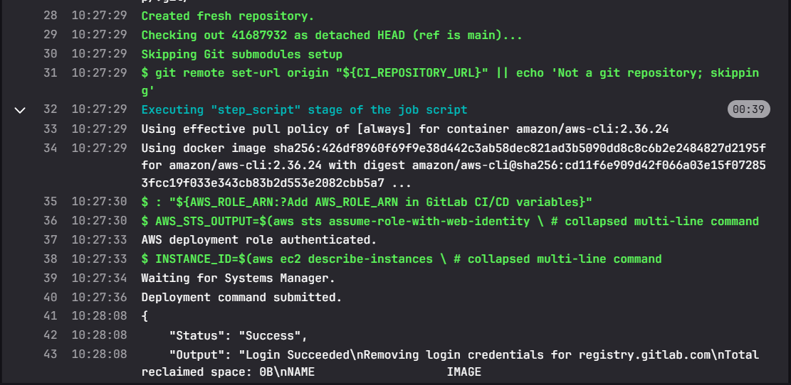

### Job Completion

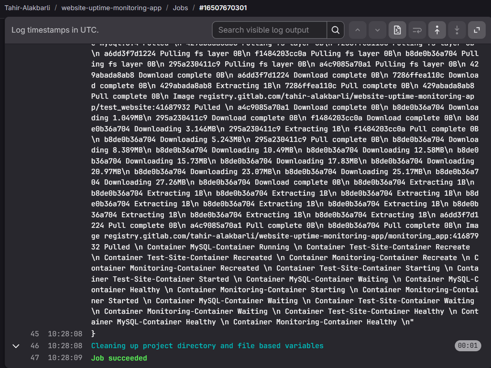

### Running Containers

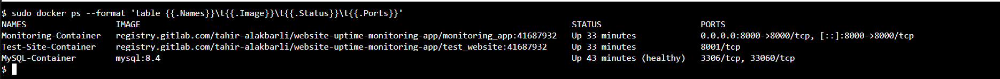

</details>

## Terraform Infrastructure

Terraform defines the AWS environment in `eu-central-1`.

The configuration manages:

- A VPC and public subnet.
- An internet gateway.
- A route table and subnet association.
- Dashboard security group rules.
- An Ubuntu EC2 instance.
- An EC2 IAM role and instance profile.
- Systems Manager permissions for the host.
- A GitLab OIDC identity provider.
- A deployment role, trust policy, and permissions.
- A generated database password.
- Instance setup configuration.

The app ran on a `t3.small` EC2 instance with an encrypted main disk. I also required IMDSv2, which makes software obtain a temporary session token before accessing instance information or IAM role credentials. This adds protection against some unwanted requests.

Dashboard access on TCP port 8000 was restricted to a configured client IPv4 address using a `/32` CIDR.

### Preparing the Host

The instance setup template prepares the server and places the AWS runtime configuration under:

```text
/opt/website-uptime-monitoring
```

The deployment job waits for a readiness marker before using that configuration.

Terraform outputs provide the instance ID, dashboard URL, and GitLab deployment role ARN.

The committed `.terraform.lock.hcl` records provider selections. Downloaded provider executables inside `.terraform/` are not included in the repository.

### Provisioning Is Separate from Deployment

I ran Terraform locally to create the environment.

GitLab deployed application images into that environment. The pipeline does not run Terraform or create the AWS infrastructure itself.

This separation also matters during cleanup: stopping local Docker containers does not stop or delete the AWS environment.

<details>
<summary>Terraform and EC2 evidence</summary>

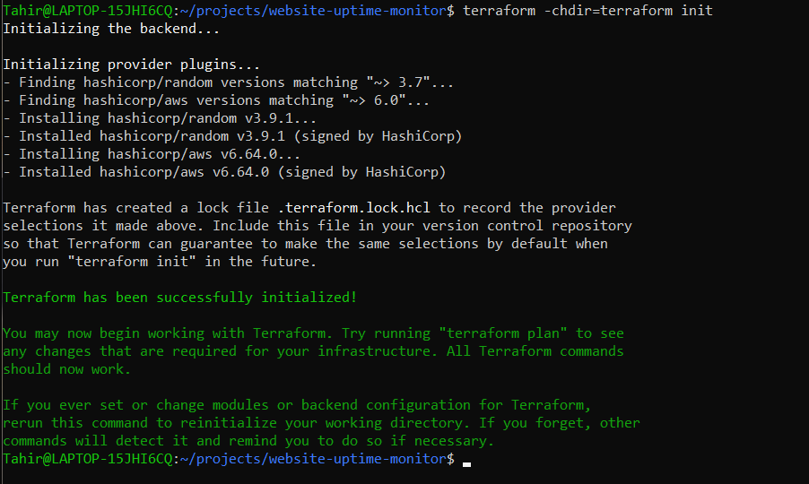

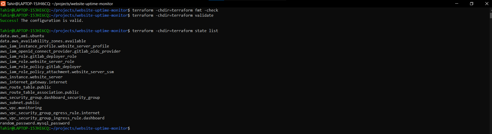

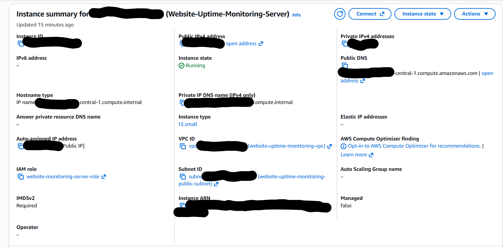

</details>

## Testing and Verification

All 11 automated test cases passed in GitLab.

The suite covers:

- Healthy website responses.
- HTTP errors.
- Request timeouts.
- Connection errors.
- History cleanup.
- Website removal.
- Invalid URL formats.
- Unsupported URL schemes.
- URLs containing embedded credentials.
- Invalid ports.
- Duplicate websites.

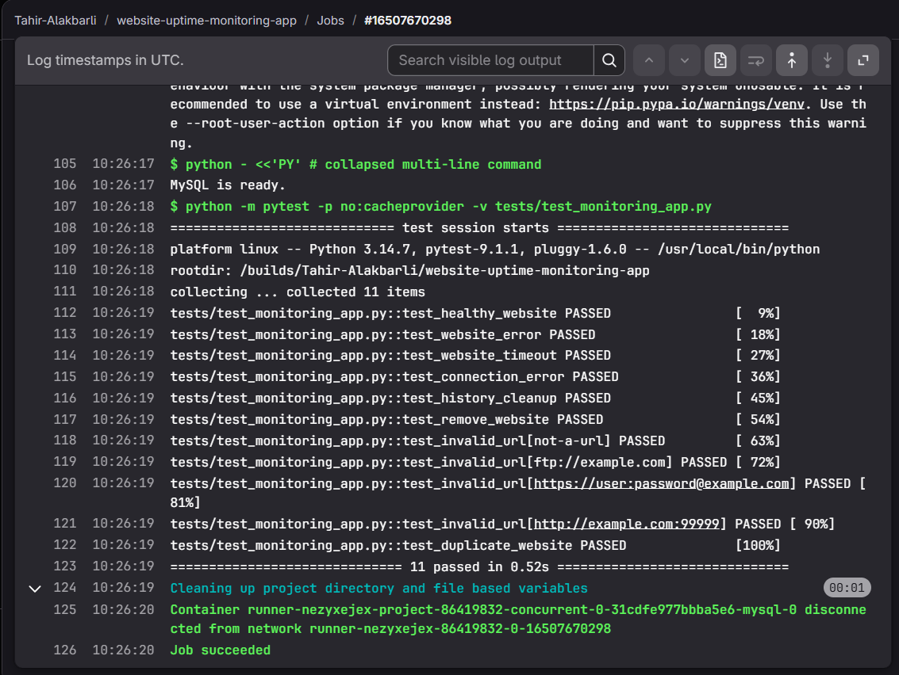

Manual verification covered parts of the setup that a passing test suite alone would not prove.

I checked container status locally and on AWS, inspected the dashboard history, added external websites, and reviewed application and deployment logs.

On EC2, a request to the dashboard returned HTTP 200. I checked public browser access separately.

The localhost check verifies the application on the server. The browser check also tests external access and Flask's public-host validation.

## Problems Encountered and Fixed

### MySQL Authentication Blocked Application Startup

MySQL returned `Access denied`, and its failing health check prevented the monitoring container from starting.

I inspected the health-check output and tested database access. A root login using the container's configured credential succeeded, which helped separate database availability from authentication configuration.

The database-user credentials, application configuration, and health-check settings were corrected and connectivity was verified.

The useful lesson was that a running database process does not prove the application can authenticate to it.

### One SQL Error Caused Every Test to Fail

The initial test run produced 11 errors with the same message:

```text
1066 (42000): Not unique table/alias: 'websites'
```

The failure came from SQL used during shared test setup. Correcting the duplicate table alias allowed the suite to run successfully.

When every test fails with the same error, shared setup is worth checking before treating each failure as a separate application bug.

### GitLab Rejected the Initial Push

The first push failed with HTTP 403. A later attempt was rejected by the protected default-branch policy.

I corrected authentication and access-token permissions so the initial commit could be pushed.

These were separate access checks: being authenticated did not automatically mean the identity could push to the protected branch.

### AWS Credentials Were Missing or Incomplete

The AWS CLI first reported missing credentials, then reported a partial configuration without a secret access key.

I completed the local AWS profile and verified it with STS caller identity before continuing with Terraform.

This also clarified the difference between the local Terraform identity and the temporary identity used by GitLab deployment.

### Containers Started but Deployment Verification Failed

The deployment pulled its images and started the services, but the dashboard request failed with:

```text
curl: (56) Recv failure: Connection reset by peer
```

Application logs showed Flask listening on port 8000. A later request from the EC2 host returned HTTP 200.

That evidence was consistent with a startup-readiness race rather than an application that remained unavailable.

The original request retried connection-refused errors but did not retry the connection-reset error. The check was updated to retry all request errors within a bounded retry period.

The following deployment passed.

A container being reported as running is not the same as its HTTP server being ready. The readiness check needed to handle temporary startup failures without ignoring a lasting failure.

### Localhost Verification Passed but Public Access Failed

After deployment succeeded, the browser showed:

```text
Bad Request
Host '<public-ip>:8000' is not trusted.
```

The request reached Flask, so this was no longer simply a missing port or unreachable server.

The trusted-host configuration allowed only `localhost` and `127.0.0.1`. Adding the active EC2 public IP, rebuilding the image, and redeploying fixed browser access.

This problem involved several separate checks:

- The server had to be reachable.
- Docker had to publish the dashboard port.
- Flask had to listen on the correct interface.
- Flask had to accept the requested hostname.

The current IP-specific trusted-host setting must be updated if another deployment receives a different public IP.

## Security and Private Configuration

The public repository excludes real environment files, AWS credentials, Terraform state, and saved plans.

The implemented configuration includes:

- Database passwords supplied through environment configuration.
- Test passwords stored in GitLab CI/CD variables.
- Temporary AWS credentials for deployment.
- A deployment trust policy restricted to the intended project and branch.
- Internal MySQL and test website services on AWS.
- Dashboard access restricted to a configured client CIDR.
- Flask trusted-host validation.
- Encrypted EC2 root storage.
- Required IMDSv2.

Terraform state can contain sensitive values even when terminal output hides them. State and saved plans need protection, not just the original password files.

These controls do not make the application production-ready. Important missing controls are listed below.

## Repository Layout

| Location | Contents |
| --- | --- |
| `README.md` | Project overview, workflow, troubleshooting, and evidence |
| `Application-Code/monitor/` | Monitoring application, dashboard template, Dockerfile, and dependencies |
| `Application-Code/test-site/` | Controlled test website and its container configuration |
| `Application-Code/tests/` | Automated application tests |
| `Application-Code/terraform/` | AWS configuration, setup template, and provider lock file |
| `Application-Code/compose.yaml` | Local application stack |
| `Application-Code/compose.aws.yaml` | AWS application stack |
| `Application-Code/.gitlab-ci.yml` | GitLab test, build, and deployment pipeline |
| `Screenshots/` | Captured project evidence |

The public copy preserves the source paths used by the application. Commands for this copy should be run from `Application-Code`.

The GitLab pipeline file is included as implementation reference. GitHub does not execute it as a GitHub Actions workflow.

Reusing the project requires configuring the environment values, registry paths, GitLab variables, AWS trust relationship, and deployment hostname for the new setup.

## Cleanup and Cost Control

After verification and screenshot capture, I used Terraform to delete the AWS resources managed by this project.

Local cleanup also removed the project containers, networks, database volumes, images, and unused Docker build cache.

The code, screenshots, documentation, and private GitLab repository were retained.

Deleting the database volumes removed the monitoring history. A future cloud deployment needs the infrastructure to be created again, followed by application deployment and hostname configuration.

This cleanup covered this project, not unrelated resources elsewhere in the AWS account.

## Limitations and Next Improvements

This project demonstrates a working deployment process, but it is not a production monitoring service.

The current setup:

- Runs on one EC2 instance without high availability.
- Uses Flask's development server.
- Serves the dashboard through HTTP rather than HTTPS.
- Has no dashboard login system.
- Uses an IP-specific trusted-host configuration.
- Keeps Terraform provisioning outside the pipeline.
- Has no remote Terraform state setup.
- Has no database backup and restore process.
- Displays failures without sending notifications.

URL validation also does not provide complete protection against server-side request forgery, or SSRF. More controls would be needed before allowing untrusted users to submit URLs.

The next improvements would be a production WSGI server, HTTPS, authentication, deployment-configured trusted hosts, database backups, and an external-access deployment check.

## Sources

Official documentation and image references relevant to this project:

- [Docker Compose](https://docs.docker.com/compose/)
- [Official MySQL Docker Image](https://hub.docker.com/_/mysql)
- [GitLab Container Registry](https://docs.gitlab.com/user/packages/container_registry/)
- [GitLab AWS OIDC Integration](https://docs.gitlab.com/ci/cloud_services/aws/)
- [Terraform Sensitive Data](https://developer.hashicorp.com/terraform/language/manage-sensitive-data)
- [AWS Systems Manager Session Manager](https://docs.aws.amazon.com/systems-manager/latest/userguide/session-manager.html)
- [Flask Configuration](https://flask.palletsprojects.com/en/stable/config/)
- [curl Reference](https://curl.se/docs/manpage.html)

## AI Support

I used AI to find bugs inside python code that I couldn't find solution to, also I used to investigate integration problems. It was also helped with choosing Flask image for the python code.

For the deployment failures, the useful part was connecting evidence from several places: GitLab output, container logs, port mappings, local HTTP requests, and browser errors.

Changes were applied and checked in the project environment through automated tests, deployment results, logs, and browser access.
